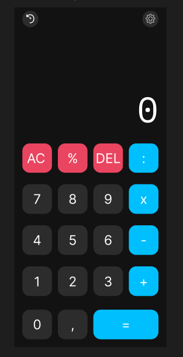

# Pemrograman Mobile

## Nama: Syafarudiansya
## NIM: 312410381
## Kelas: TI 24 A6

## 1. Splashscreen

Saya punya 2 tipe Splashscreen
### 1. 

### 2. 

## 2. StoryBoard

## 3. Mockup

## 4. UI

## 5. UX
[🎥 Lihat video demo](https://drive.google.com/file/d/1tAKk7U96HJWBI4w9FEhrXcPOw7PcdpwL/view?usp=sharing)

